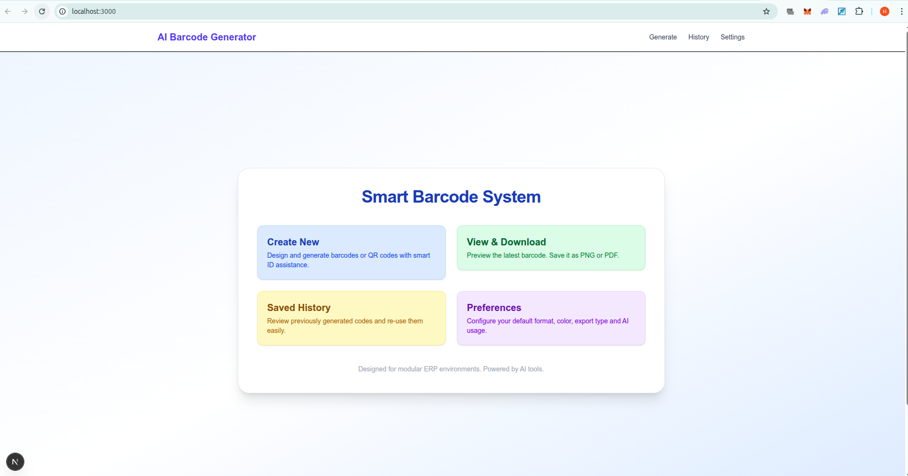
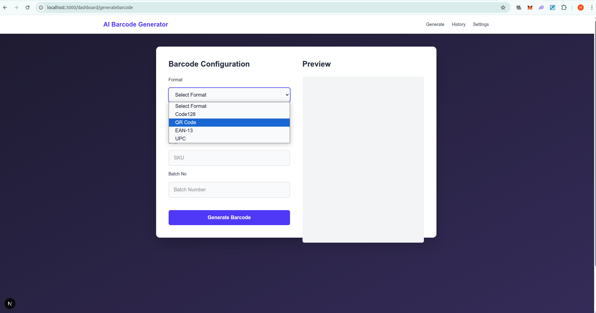
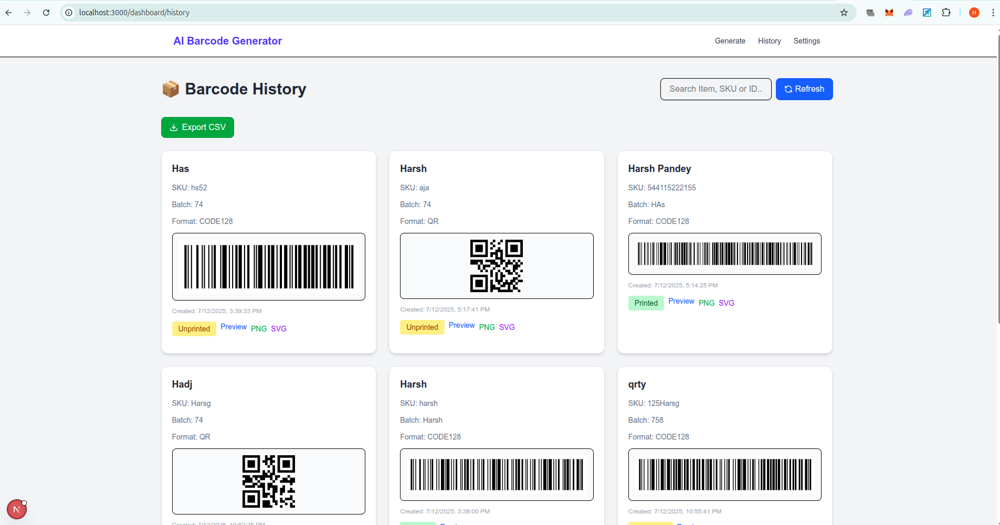
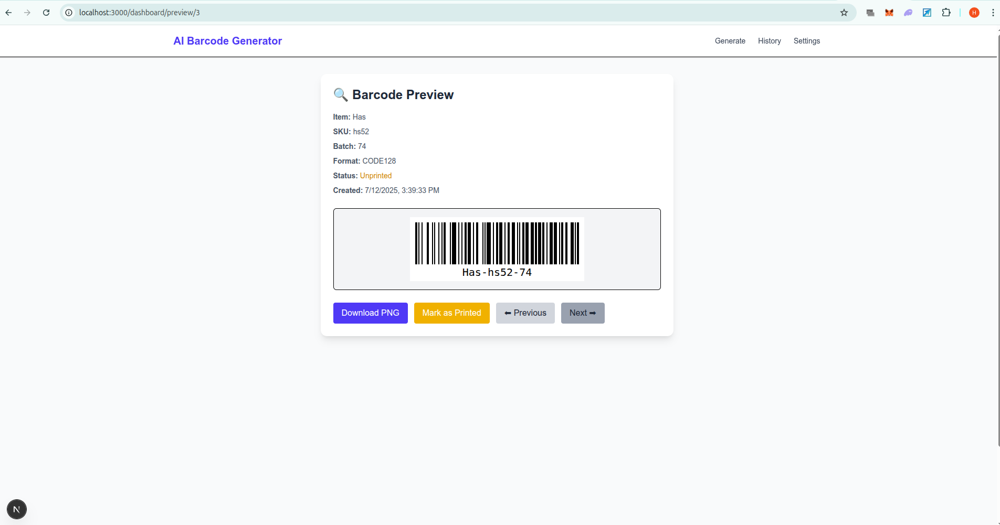

# 🧠 AI Barcode Generator

A modern and intelligent Barcode Generator system for ERP environments (Retail, Pharmacy, Hospital, School, etc.).  
Generate, preview, save, export, and track barcodes and QR codes with batch metadata and smart ID support.

> 🚀 **Note:** Deployment link is currently under maintenance due to route errors. I will share the hosted URL as soon as the issue is resolved.

---

## 📸 Preview

### 🏠 Dashboard

### 🔧 Generate Barcode

### ✅ Barcode Created

### 🕓 Barcode History

### 🔍 Barcode Preview

---

## ✨ Features

- ✅ Create Barcode / QR Code (Code128, QR, EAN-13, UPC)
- 👁️ Real-time preview before saving
- 💾 Save barcode with metadata (Item Name, SKU, Batch No.)
- 🕓 Barcode history with status (Printed / Unprinted)
- ⬇️ Export options: PNG, SVG, CSV
- 🔁 View, Reuse, and Track barcodes
- 🧠 Built for ERP environments — modular & scalable

---

## 🔧 Tech Stack

- **Frontend:** Next.js 15, React, Tailwind CSS, ShadCN UI
- **Database:** PostgreSQL via Drizzle ORM
- **Barcode Libs:** jsBarcode, qrcode.react
- **Export Tools:** html-to-image, jsPDF
- **Language:** TypeScript

---

## 📁 Project Structure

 barcode-generator
├── 📂 app
│ ├── dashboard
│ └── preview
├── 📂 components
│ └── ui/
├── 📂 lib
│ └── utils.ts
├── 📂 db
│ └── schema.ts (Drizzle ORM)
├── 📂 public
│ └── screenshots/ (Images for this README)
├── 📂 api
│ └── barcodes.ts

# Install dependencies
npm install

# Start development server
npm run dev

